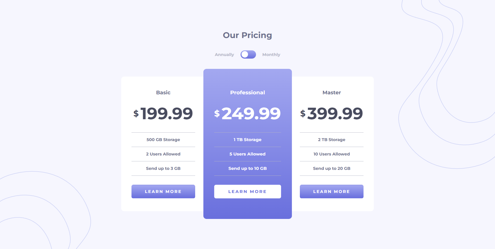

# Pricing component with toggle


## Visão Geral

### Projeto de uma página de contratação de serviço de armazenamento em nuvem. 

#



⏳ Projeto realizado em 3 dias.
#
## Construido com:
- HTML
- CSS
  - Layout responsivo
  - Grid Layout
- JavaScript

## Funcionalidades
- Com o botão de alternar plano, o usuário pode optar em contratar o plano anual ou plano mensal.

## O que eu aprendi:
- Manipulação do DOM
- Seletor de classe no JS
```js
let monthly = document.querySelectorAll('.price-monthly') {
}
```
- Eventos no JS 
```js
checkBox.addEventListener('change', function() {
}
```
- Media Query no CSS

```css
@media only screen and (max-width: 1024px) {
  body {
    font-size: 14px;
  }
}
```


## Link

Veja o projeto aqui: [Acessar 🌍](https://devhiderlan.github.io/pricing-component-with-toggle/)

## Autor

Hiderlan Santana: [Linkedin](https://www.linkedin.com/in/hiderlan-santana/)
